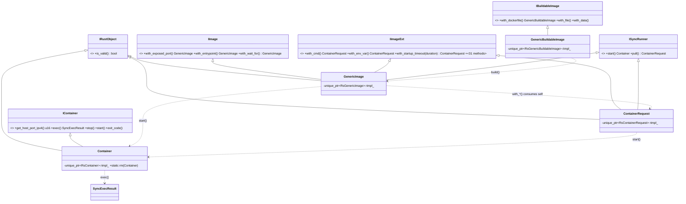
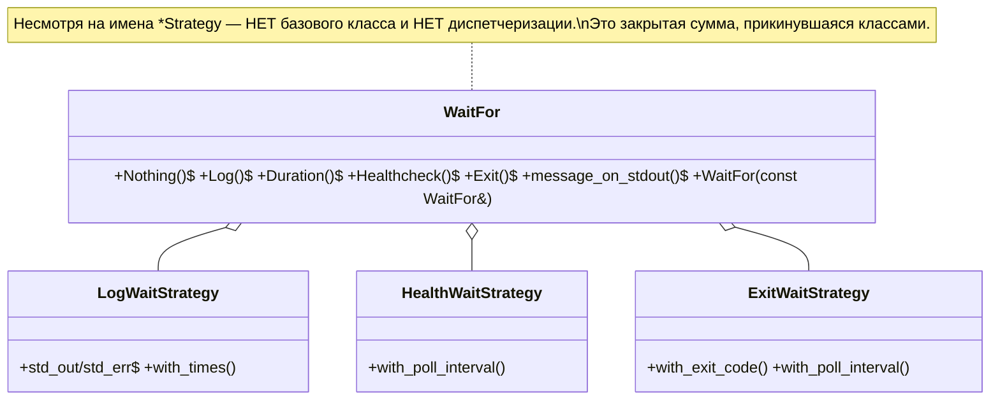

# Оценка C++-интерфейсов гибридного форка (testcontainers-cxx) для нативной версии

> Анализ существующего форка `testcontainers-cxx`, где C++ — тонкая обёртка над Rust через cxx FFI.
> Вопрос: насколько такая организация интерфейсов подходит для **полностью нативной** C++-версии.
> Короткий вывод: **домен/нейминг/раскладка файлов/тесты — оставляем; организацию интерфейсов
> (трейт-зеркала, FFI-обёртки, consume-self билдеры, move-only на данных) — переделываем.**

## Как устроен форк сейчас

Каждый публичный класс (`GenericImage`, `ContainerRequest`, `Container`, value-типы) держит
`std::unique_ptr<RsXxx, void(*)(RsXxx*)>` — opaque-указатель на Rust-объект, наследует
`IRustObject` (`is_valid()`), move-only (copy удалён). Интерфейсы `I*` 1:1 повторяют Rust-трейты.
Билдеры `with_*` **поглощают** внутренний Rust-box и возвращают новую обёртку **по значению**
(зеркало Rust `fn with_x(self) -> Self`).

## Диаграммы текущего дизайна

### Билдеры / образы / рантайм


### WaitFor (сумма-тип)


## Аудит Rust-измов (по приоритету)

| # | Элемент | Что зеркалит | Проблема в нативном C++ | Идиоматичная замена |
|---|---|---|---|---|
| **P0** | `IRustObject` + `is_valid()` (impl = `bool(rimpl_)`) | FFI-учёт «жив ли box / не moved-from» | Нативный value-тип всегда валиден; `is_valid()` нужен только из-за P1. Виртуальный вызов, утекающий деталь реализации; тесты завязаны на него | **Удалить.** Значение всегда валидно. Для одного реального «опустошённого» кейса (`Container` после `rm`/move) — `explicit operator bool` только у `Container` |
| **P0** | Билдеры «consume self → return Self» (`with_*` релизит `rimpl_`) | Rust `fn with_x(self) -> Self` | **Тихий use-after-move:** `a.with_env(); a.with_cmd();` → разыменование null. Ради ловли этого и существует весь `is_valid()`. Плюс heap-аллокация на каждый шаг. В тестах поэтому только однострочные цепочки | **Мутирующий билдер, возвращающий `*this`**, ref-qualified: `T& with_x(...) &; T&& with_x(...) &&;` Без moved-from, без realloc, именованный конфиг переиспользуем |
| **P0** | `IImageExt`/`IImage`/`ISyncRunner` + дублирование ~31 метода в 3 местах (интерфейс + `GenericImage` + `ContainerRequest`) | Rust blanket-impl `impl<I: Image> ImageExt for I` | Возвраты разные у разных реализаторов (`GenericImage::with_*`→`ContainerRequest`, а `ContainerRequest::with_*`→`ContainerRequest`) — «интерфейс» неюзабелен полиморфно, никто не зовёт через `IImageExt*`. Чистый налог vtable+поддержки | **Удалить эти интерфейсы.** Один конфиг-билдер, тело `with_*` один раз (или CRTP-mixin). Без virtual |
| **P1** | Move-only / copy=delete на данных (`ContainerPort`, `CgroupnsMode`, `Mount`, `Host`, ip-типы) | move-only `rust::Box` | `ContainerPort` это `{u16, enum}`, `CgroupnsMode` — 2 состояния, а копировать нельзя, в `vector` не положишь. `WaitFor` пришлось спец-городить copy-ctor чтобы жить в векторе — доказательство, что правило неверное | **Обычные копируемые struct/enum.** `enum class Proto{Tcp,Udp,Sctp}; struct ContainerPort{uint16_t port; Proto proto;};` |
| **P1** | `with_startup_timeout(duration<uint64_t,nano>)` | lossless перенос Rust `Duration` через один u64 | Враждебная сигнатура: беззнаковые наносекунды; `hours(2)` может требовать `duration_cast`, `double`/негативные не лезут | `std::chrono::milliseconds` или шаблон `duration<Rep,Period>` с приведением внутри. То же для `Healthcheck`/wait-стратегий |
| **P1** | `WaitFor`-enum как класс с фабриками + 3 payload-класса | Rust enum не переходит через cxx | Имена `*Strategy` намекают на полиморфизм, которого нет; boxed + move-only для обычных данных | **`std::variant<WaitNothing, WaitLog, WaitDuration, WaitHealth, WaitExit>`**, каждый — мелкий копируемый struct; в движке `std::visit`. Удобные фабрики оставить |
| **P2** | `unique_ptr<T,void(*)(T*)>` + private raw-ctor + `friend` + `into_box/into_raw` | владение `rust::Box` из C++ | Толстый deleter, heap на объект, friend-ctor и boilerplate в каждом методе | **Исчезает.** Данные по значению (`string`/`vector`), классы схлопываются в агрегаты |
| **P2** | `std::optional` ⇄ `rust::Vec`(0/1) | у cxx нет моста optional | Лишние аллокации, мутный код | Прямой `std::optional<T>` |
| **P2** | `with_ulimit` тащит баг testcontainers-rs (коммент-warning) | верное зеркалирование бага | Баг становится твоим | Реализовать корректно против Docker API (`Ulimit{Name,Soft,Hard}`) |
| **P2** | Stringly-typed `Error` | Rust `Result` деградирует в `String` через cxx | Теряется структура (kind, id, http-status) | Иерархия исключений (`DockerApiError`/`WaitTimeout`/…) с кодами — теперь HTTP-слой наш |
| **P3** | `Container::rm(Container)` статик-консумер; non-const аксессоры `SyncExecResult` | Rust `fn rm(self)` / `&mut self`-ридеры | Неидиоматично | `void remove() &&;`; читать в буферы при конструировании, аксессоры `const` |

## Что ОСТАВИТЬ

1. **Раскладку файлов/namespace** (`core/`, `core/wait/`, `system/ip/`, один тип — один файл).
2. **Нейминг и набор value-типов** (`ContainerPort`, `Mount`, `Healthcheck`, `Host`, `CopyDataSource`,
   `CgroupnsMode`, `ExecCommand`, ip-типы, `UrlHost`) и фабрики (`ContainerPort::tcp(6379)`). Только
   сделать их копируемыми struct/enum.
3. **Статические именованные фабрики** для сумм-типов — читаемо и discoverable.
4. **RAII `Container` с авто-stop в деструкторе** — единственное место, где move-only/RAII оправдан
   (владеет реальным внешним ресурсом). Move-only оставить **здесь**, убрать везде ещё.
5. **`Error : std::exception` + единый seam `call_map_error`** — паттерн хороший, обогатить полями.
6. **Структуру тестов** (плотные unit-тесты, `testutils`, `unit/` vs `integration/`).
7. **Настоящий полиморфный `IWaitStrategy`** — но только если заводим пользовательские стратегии (см. ниже).

## Рекомендуемая нативная форма (C++17/20)

**Где полиморфизм нужен, а где нет:**
- **НЕ нужен (удалить интерфейсы):** `IRustObject`, `IImage`, `IImageExt`, `ISyncRunner`, `ISyncBuilder`
  — трейт-зеркала с единственной реализацией. Заменить одним конкретным билдером + свободными функциями.
- **Нужен (оставить/ввести осознанно):**
  - **`Image` / пользовательские образы** — это настоящая точка расширения. Маленький абстрактный базовый
    класс (или `std::function`-конфиг), чтобы `start()` принимал любой образ юзера (`RedisImage`, …).
  - **Wait-стратегии** — реальный `IWaitStrategy{ virtual bool is_ready(const Container&) const; }`
    **только если** даём пользователю свои стратегии; иначе `std::variant` легче и исчерпывающ.

**Стиль билдера — мутирующий, ref-qualified:**
```cpp
enum class Proto { Tcp, Udp, Sctp };
struct ContainerPort { std::uint16_t port; Proto proto = Proto::Tcp; };
inline ContainerPort tcp(std::uint16_t p) { return {p, Proto::Tcp}; }

class GenericImage {
public:
  GenericImage(std::string name, std::string tag)
      : name_(std::move(name)), tag_(std::move(tag)) {}

  GenericImage&  with_exposed_port(ContainerPort p) &  { ports_.push_back(p); return *this; }
  GenericImage&& with_exposed_port(ContainerPort p) && { ports_.push_back(p); return std::move(*this); }
  GenericImage&  with_wait(WaitFor w) &  { waits_.push_back(std::move(w)); return *this; }
  GenericImage&& with_wait(WaitFor w) && { waits_.push_back(std::move(w)); return std::move(*this); }

  Container start() const;                               // копируемый конфиг → много контейнеров
private:
  std::string name_, tag_;
  std::vector<ContainerPort> ports_;
  std::vector<std::pair<std::string,std::string>> env_;
  std::vector<WaitFor> waits_;
  std::chrono::milliseconds startup_timeout_{60'000};
};
```
```cpp
auto cfg = GenericImage("redis","7.2").with_exposed_port(tcp(6379))
             .with_wait(wait_for::stdout_message("Ready to accept connections"));
auto c1 = cfg.start();   // переиспользуемо — раньше было невозможно (use-after-move)
auto c2 = cfg.start();
```

Это заодно **схлопывает `GenericImage` и `ContainerRequest` в один билдер** (в Rust их два из-за
перехода типа для blanket-impl; в C++ это ограничение отсутствует) и убирает тройное дублирование `IImageExt`.

**Пользовательский образ (настоящий полиморфизм):**
```cpp
struct Image {
  virtual ~Image() = default;
  virtual std::string descriptor() const = 0;              // "name:tag"
  virtual std::vector<ContainerPort> exposed_ports() const { return {}; }
  virtual std::vector<WaitFor>       ready_conditions() const { return {}; }
  virtual std::vector<std::string>   cmd() const { return {}; }
};
struct RedisImage : Image {
  std::string descriptor() const override { return "redis:7.2"; }
  std::vector<ContainerPort> exposed_ports() const override { return {tcp(6379)}; }
  std::vector<WaitFor> ready_conditions() const override {
    return { wait_for::stdout_message("Ready to accept connections") };
  }
};
Container start(const Image& img);
```

**Wait — закрытый variant (дефолт):**
```cpp
namespace wait {
  struct Nothing {};
  struct Log      { std::string msg; Stream stream = Stream::Stdout; int times = 1; };
  struct Duration { std::chrono::milliseconds d; };
  struct Health   { std::chrono::milliseconds poll{500}; };
  struct Exit     { std::optional<std::int64_t> code; std::chrono::milliseconds poll{500}; };
}
using WaitFor = std::variant<wait::Nothing, wait::Log, wait::Duration, wait::Health, wait::Exit>;
```

### Итог изменений
- **Удалить:** `IRustObject`, `IImage`, `IImageExt`, `ISyncRunner`, `ISyncBuilder`, все `details/` FFI-хелперы.
- **Слить:** `GenericImage`+`ContainerRequest` → один билдер; `*WaitStrategy` → payload-структуры variant.
- **Сделать копируемыми struct/enum:** `ContainerPort`, `CgroupnsMode`, `Mount`, `Host`, `CopyDataSource`, `WaitFor`, ip-типы.
- **Оставить move-only/RAII:** только `Container`.
- **Оставить настоящий полиморфизм:** пользовательский `Image` (+ опц. `IWaitStrategy`).
